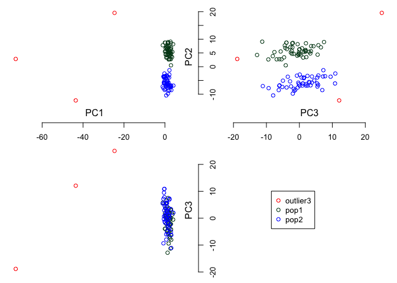

<!-- README.md is generated from README.Rmd. Please edit that file -->

# KRIS 

<!-- badges: start -->

[](https://github.com/kridsadakorn/kris/actions)
[](https://CRAN.R-project.org/package=KRIS)
[](https://codecov.io/gh/kridsadakorn/kris)
[](https://opensource.org/licenses/MIT)
[](https://www.tidyverse.org/lifecycle/#maturing)
<!-- badges: end -->

`KRIS` (**K**een and **R**eliable **I**nterface **S**ubroutines for
bioinformatic analysis) is the package providing useful functions which
are needed for bioinformatic analysis such as calculating linear
principal components from numeric data and Single-nucleotide
polymorphism (SNP) dataset, calculating fixation index (Fst) using
Hudson method, creating scatter plots in 3 views, handling with PLINK
binary file format, detecting rough structures and outliers using
unsupervised clustering, and calculating matrix multiplication in the
faster way for big data..

## Installation

You can install the released version of KRIS from
[CRAN](https://CRAN.R-project.org) with:

``` r
install.packages("KRIS")
```

Alternatively, you can install the dev version of KRIS from
[Gitlab](https://gitlab.com/chaichoompu/kris) with

``` r
install.packages("remotes")
remotes::install_gitlab("chaichoompu/kris", dependencies = TRUE)
```

## Document

You can see the reference manual from:
<https://chaichoompu.gitlab.io/kris_doc/index.html>

## Example

This is a basic example which shows you how to use the package:

``` r
library(KRIS)

data(example_SNP)
```

`example_SNP` consists of the simulated SNP data `simsnp` and the sample
labels `sample_labels`.

``` r
summary(simsnp)
#>          Length Class      Mode   
#> snp      206000 -none-     numeric
#> snp.info      6 data.frame list   
#> ind.info      6 data.frame list
summary(sample_labels)
#>    Length     Class      Mode 
#>       103 character character
```

To calcualte the first three linear principal components from SNP data:

``` r
PCs <- cal.pc.linear(simsnp$snp, no.pc = 3)
```

You can visualize 3 dimensions for the first three principal components
as:



## About

  - Prof. Kristel Van Steen, visit
    <a href="http://bio3.giga.ulg.ac.be/" border=0 style="border:0; text-decoration:none; outline:none"></a><br />
  - Kridsadakorn Chaichoompu, visit
    <a href="http://www.biostatgen.org/" border=0 style="border:0; text-decoration:none; outline:none"></a><br />
